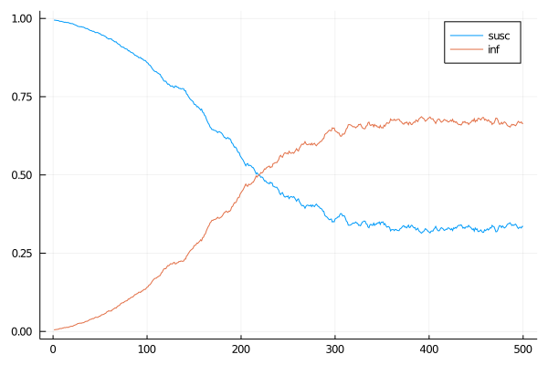

# Introduction

In the previous worksheet we have built a version of our agent-based epidemiological model with simple step-wise updating. Implementing models this way is a lot more straightforward and easier to understand for beginners. However, step-wise updating often leads to implicit, yet significant assumptions about the underlying process that are difficult to detect and change.

In the following I am going to show how to implement an event-based version of the same model using a set of macros I have prepared.

# Prelude

Our macro package is not installed but sits in the local directory. For complicated reasons there is no way to let Julia find local packages in this particular situation, therefore we have to `include` (i.e. read and insert) the code and then import the local module.


```julia
using Random
using Luxor
using Plots

# read the code that declares the module
include("SimpleAgentEvents/src/SimpleAgentEvents.jl")

# actually import the module
using .SimpleAgentEvents
using .SimpleAgentEvents.Scheduler
```

# Type declarations

We start with the simple spatial SI model from the previous worksheet. The type therefore doesn't change but for the sake of brevity I have renamed it to `Person`.


```julia
# all possible states a person can be in
@enum Status susceptible infected

# this is our agent type
mutable struct Person
    # state
    status :: Status
    # other agents this one can infect or be infected by
    contacts :: Vector{Person}
    # location in the world
    x :: Float64
    y :: Float64
end

# how we construct a person object
Person(x, y) = Person(susceptible, [], x, y)
Person(state, x, y) = Person(state, [], x, y)
```


    Person


The simulation now has to include a scheduler object that is going to be used by the macros to keep track of the order of events that have to be executed.


```julia
mutable struct Simulation
    # the scheduler keeps track of which agent is going to do what when
    scheduler :: PQScheduler{Float64}
    # parameters:
    # infection rate
    inf :: Float64
    # recovery rate
    rec :: Float64

    # and this is our population of agents
    pop :: Vector{Person}
end

# the simulation system needs this for technical reasons
scheduler(sim :: Simulation) = sim.scheduler

Simulation(i, r, pop) = Simulation(PQScheduler{Float64}(), i, r, pop)
```


    Simulation


# The model

Now we can write our actual model. This looks a lot different from the previous version since we are using macro calls to declare *what* the model does instead of specifying in code *how* it does it. 

Sidenote: [Macros](https://docs.julialang.org/en/v1/manual/metaprogramming/#man-macros) in Julia are a way to modify source code before it is being compiled. They are similar in purpose to C's preprocessor macros or C++' templates but vastly more powerful. Effectively macros make it possible to extend the language with custom syntax. Macro calls in Julia always start with an `@` sign.

The entire code block below is *one* single call of the macro `@processes` (I made `@poisson` look like a macro to make it stand out, but it isn't). The macro takes 4 arguments, in this case `SI`, `sim`, `person::Person` and the code block between `begin` and `end` and analyses them to produce a number of functions that we can then use to run our simulation.

So, what does all that mean? `@processes` declares (between `begin` and `end`) a new set of activities called `SI` that can be performed by an object `person` of type `Person` using a simulation object `sim` (that has to contain a scheduler!). 

Each activity is declared with an event distribution (`@poisson` is the only one implemented at this point) that takes a rate (over time) as an argument. The second part of the activity declaration is the condition (after `~`) that determines *each time* whether the activity is executed or not and the actual code (after `=>`) to be called.

In this case a `Person` object can "do" two things - it can become infected with a rate that is proportional to the number of infected contacts it has; or it can recover with a fixed rate over time.

An important note: activity code (the part after `=>`) *has* to return a vector of *all* objects that might be affected by the event! There is no other way for the simulation to know that rates might have changed.


```julia
# usage:
# processes NAME SIMULATION AGENT ACTIONS
@processes SI sim person::Person begin
 
    # each action has the format
    # distribution(rate) ~ condition => action
    # currently only poisson is implemented
    
    # infection with rate proportional to prop. infected contacts
    @poisson(sim.inf * count(p -> p.status == infected, person.contacts)/length(person.contacts)) ~
        # a person has to be susceptible in order to get infected
        person.status == susceptible        => 
            begin
                # status changes
                person.status = infected
                # *important*: 
                # return all agents that need to be activated
                # including *all* whose circumstances have changed
                [person; person.contacts]
            end

    # recovery
    @poisson(sim.rec)  ~
        person.status == infected           => 
            begin
                person.status = susceptible
                [person; person.contacts]
            end
end

# and this is the entire model
```


    spawn_SI (generic function with 1 method)


# Running the model

Now we can create the simulation and run it. We are again using the setup code in `setup_world.jl`.


```julia
include("setup_world.jl");
```

This sets up the simulation and the agents. Nothing much has changed here from before.


```julia
function setup_sim(;r_i, r_r, xs, ys, n_inf, seed)
    # for reproducibility
    Random.seed!(seed)
 
    # create a population of agents living on a 
    # 50x50 grid (von Neumann)
    pop = setup_grid(Person, xs, ys)

    # create a simulation object with parameter values
    sim = Simulation(r_i, r_r, pop)
    
    # pick n_inf random agents and set them to infected
    for p in rand(sim.pop, n_inf)
        p.status = infected
    end

    sim
end
```


    setup_sim (generic function with 1 method)


Running the model works differently now. The scheduler takes care of executing events, however, we have to "activate" each object in the simulation once at the beginning. The `@processes` declaration above has created a function `spawn_SI` (note the suffix `SI`) for exactly that purpose.


```julia
function spawn(sim)
    # spawn activates agents
    # this function was generated by the model declaration
    for person in sim.pop
        spawn_SI(person, sim)
    end
end
```


    spawn (generic function with 1 method)


Most of the `run_sim` function hasn't changed much either. Instead of explicitly calling update functions we now tell the scheduler to advance the time and execute all activities that happen in that time span. Note that the time step is completely arbitrary - instead of advancing 1 time units 10 times I could have just as well advanced 0.1 time units 100 times with exactly the same result (save for the frequency of output of course).


```julia
function run_sim(sim, to_time, verbose = false)
    # we keep track of the numbers
    n_inf = Int[]
    n_susc = Int[]

    while time_now(sim.scheduler) < to_time
        # tell the scheduler to run all actions up to t+1
        upto!(sim.scheduler, time_now(sim.scheduler) + 1.0)
        push!(n_inf, count(p -> p.status == infected, sim.pop))
        push!(n_susc, count(p -> p.status == susceptible, sim.pop))
        # a bit of output
        if verbose
            println(t, ", ", n_inf[end], ", ", n_susc[end])
        end
    end
    
    # return the results (normalized by pop size)
    n = length(sim.pop)
    n_inf./n, n_susc./n
end
```


    run_sim (generic function with 2 methods)


```julia
sim = setup_sim(r_i=0.1, r_r=0.03, xs=50, ys=50, n_inf=10, seed=42)
spawn(sim)
inf, susc = run_sim(sim, 500.0)

Plots.plot([susc, inf], labels = ["susc" "inf"])
```


    

    


# Visualisation

Our agent type hasn't changed, so we can just re-use the visualisation from the previous worksheet.


```julia
# this uses the Luxor package, which allows for very straighforward 
# generation of SVG drawings
@svg begin
    # scale from model coordinates to screen coordinates
    f_scale = 11
    # size of agents
    p_size = 5
    
    # otherwise we'll only have to lower right quarter
    # (don't ask...)
    origin(0, 0)

    # paint it black
    sethue("black")
    
    # ** first draw all connections
    # (we don't want to worry about agent size here,
    #  so we just draw the lines from x1,y1 to x2,y2
    #  and paint the agents on top of that)
    
    # for each agent
    for p in sim.pop
        x1 = p.x * f_scale
        y1 = p.y * f_scale
        
        # draw all lines to other agents
        for p2 in p.contacts
            x2 = p2.x * f_scale
            y2 = p2.y * f_scale
            
            setline(1)
            setdash("solid")
            line(Point(x1, y1), Point(x2, y2), :stroke)
        end
    end
    # yes, this draws all lines twice
    # who cares

    # ** now draw all agents
    
    for p in sim.pop
        x = p.x * f_scale
        y = p.y * f_scale
        
        # show the status as colours
        if p.status == infected
            sethue("red")
        elseif p.status == susceptible
            sethue("blue")
        end
        
        circle(Point(x, y), p_size, :fill)
    end
end
```


    

    


# Things to try

* Run for longer, is there an equilibrium or an end state?
* Try different values for `inf` and `rec`.
* Does changing the shape of the world (`x` vs. `y` size) have an effect?
* Add more patient zeros, e.g. at 50, 50.
